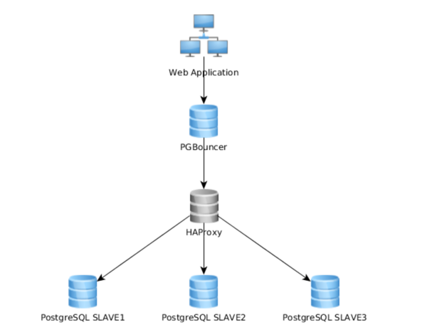

# What is pgbouncer?
```
https://www.pgbouncer.org/ 是一个轻量级的 PostgreSQL 连接池器。它可以在客户端和 PostgreSQL 服务器之间提供一个连接代理，
以减少连接开销和管理连接资源。它支持多种连接模式，如会话、事务和语句，以适应不同的应用场景。它还提供了一些高级功能，
如 TLS 加密、在线重启、参数跟踪等。它是一个开源的项目，可以在 GitHub 上找到³。它的主页是 [1](^1^)，
其中有更多的信息、文档、下载链接和社区资源。它的最新版本是 1.21.0，于 2023 年 10 月 16 日发布，增加了对命名预备语句的支持，这是一个长期以来的需求⁵。
```
源: 与必应的对话， 11/28/2023
(1) GitHub - cloudflare/cf-pgbouncer: lightweight connection pooler for .... https://github.com/cloudflare/cf-pgbouncer.
(2) PgBouncer - lightweight connection pooler for PostgreSQL. https://www.pgbouncer.org/.
(3) PgBouncer 1.19.0 released - PostgreSQL. https://www.postgresql.org/about/news/pgbouncer-1190-released-2635/.
(4) PgBouncer config. https://www.pgbouncer.org/config.html.
(5) PgBouncer 1.18.0 released - PostgreSQL. https://www.postgresql.org/about/news/pgbouncer-1180-released-2556/.
(6) undefined. https://github.com/pgbouncer/pgbouncer.
(7) undefined. https://www.pgbouncer.org/2022/12/pgbouncer-1-18-0.
(8) undefined. https://www.pgbouncer.org/2023/05/pgbouncer-1-19-0.

# how to do HA solution

```
要避免单点故障，你可以采用以下一些策略：
- 在应用服务器和 PostgreSQL 服务器之间部署多个 PgBouncer 节点，使用负载均衡器（如 HAProxy）来分配连接请求。这样，如果某个 PgBouncer 节点出现故障，其他节点可以接管连接，保证数据库的可用性¹²。
- 在 PgBouncer 节点上配置 Keepalived，以实现高可用性。Keepalived 可以检测 PgBouncer 节点的运行状态，并在故障发生时自动切换虚拟 IP 地址，从而避免连接中断³⁴。
- 使用 Azure Database for PostgreSQL Flexible Server 的内置 PgBouncer 功能，它可以自动管理连接池，并提供高可用性、故障转移和灾难恢复等特性⁵。

```

源: 与必应的对话， 11/28/2023
(1) Connection pooling strategy for PostgreSQL Using PgBouncer. https://learn.microsoft.com/en-us/azure/postgresql/flexible-server/concepts-connection-pooling-best-practices.
(2) Introduction to pgbouncer | Fadhil Dev Blog. https://www.fadhil-blog.dev/blog/pgbouncer/.
(3) PostgreSQL Replication Best Practices - Part 1 | Severalnines. https://severalnines.com/blog/postgresql-replication-best-practices-part-1/.
(4) Connection Management in PostgreSQL: A Guide | Severalnines. https://severalnines.com/blog/connection-management-postgresql-guide/.
(5) pgBouncer Setup, Extended Architecture, Use-cases and leveraging SO .... https://www.enterprisedb.com/postgres-tutorials/pgbouncer-setup-extended-architecture-use-cases-and-leveraging-soreuseport.

## pgbouncer + haproxy

```
https://dba.stackexchange.com/questions/56559/postgresql-high-availability-scalability-using-haproxy-and-pgbouncer
https://aws.amazon.com/cn/blogs/database/set-up-highly-available-pgbouncer-and-haproxy-with-amazon-aurora-postgresql-readers/
https://developer.aliyun.com/article/509575
```
